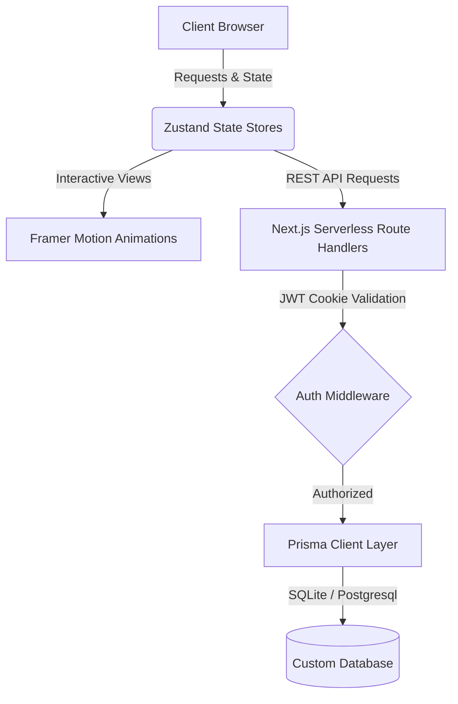

# 📌 Pinverse — Full-Stack Visual Discovery Platform

A premium, highly interactive, and professionally engineered **Pinterest-inspired full-stack web application**. Built using **Next.js 16 (App Router, Turbopack)**, **TypeScript**, **Tailwind CSS 4**, **shadcn/ui**, **Prisma ORM**, **Framer Motion**, and a secure **cookie-based JWT authentication session system**.

---

## 🎨 Implemented Features & Core Stack

### 🚀 Key Capabilities Developed



*   **📌 Beautiful Masonry Feed Layout:** Custom multi-column grid layout built utilizing dynamic pure CSS column scaling rather than heavy JS computations, rendering fluidly across all viewport break-points.
*   **🔄 Infinite Scrolling Feed:** Employs browser-native `IntersectionObserver` API targets to query paginated REST feed requests dynamically as the user scrolls down, offering responsive loading using skeleton state blocks.
*   **🔒 Complete JWT Authentication:** Secure cookie-based sign-in and sign-up with password hashing (`SHA-256` + salt), custom CSRF protection, request rate limiting, and automated auth-state routing hooks.
*   **📁 Boards & Organizational Folders:** Multi-board organization system allowing creators to bookmark public or private folders containing custom assortments of saved visual assets.
*   **💬 Modern Social Interactions:** Real-time-ready notification delivery metrics, follow/unfollow states between profile creators, instant likes toggling, and comment feeds for all assets.
*   **🌓 Unified Systems Dark Mode:** System-adaptive theme-switch state handlers utilizing customized standard CSS variable variables that match design components flawlessly without hydration flash errors.

---

## 📁 Repository Directory Maps

```
pinverse/
├── prisma/
│   ├── schema.prisma          # Clean, 8-Model Database Structure
│   └── seed.ts                # Rich, High-quality Demo Seeder Script
├── src/
│   ├── app/
│   │   ├── layout.tsx         # Top-Level Layout (Providers, Fonts, SEO)
│   │   ├── page.tsx           # Single-Page App Core Controller
│   │   └── api/               # Complete REST API Route Controllers
│   ├── components/
│   │   ├── pinverse/          # Custom Platform Views (Feed, detail, auth, boards, etc.)
│   │   └── ui/                # Base Components (Fully Reusable)
│   ├── stores/                # Zustand client state-management stores
│   └── lib/                   # Security handlers, session tokens, local/S3 storage providers
├── public/                    # Image assets & localized media storage
└── package.json               # Package dependencies configuration
```

---

## ⚙️ Quick Start Local Setup

### 1️⃣ Dependencies & Environment Settings
Install package dependencies using [Bun](https://bun.sh) (recommended for speeds) or Node.js 18+:
```bash
# Install NPM modules
bun install

# Initialize local environment vars template
cp .env.example .env
```

### 2️⃣ Initialize Database Schema
Generate database client bindings and seed local SQLite models instantly:
```bash
# Auto-generate DB structures and create database custom file
bun run db:push

# Populate database models with high-quality mockup data
bun run db:seed
```

This creates a main active demo user profile for immediate evaluations:
*   **📧 Email Credentials:** `demo@pinverse.com`
*   **🔑 Password:** `demo123`

### 3️⃣ Fire Up Local Development Server
```bash
bun run dev
```
Open **[http://localhost:3000](http://localhost:3000)** inside your browser. Enjoy a smooth, professional Pinterest experience!

---

## 🚀 Technical Architecture Overview

| Element Layer | Technology Integrated | Purpose |
| :--- | :--- | :--- |
| **User Interface** | Tailwind CSS 4 + Framer Motion | Offers glassmorphism panels, interactive toasts, fluid column cards, and premium transition animations. |
| **Logic & State** | React 19 + Zustand Stores | Centralizes application interactions, handling API responses and mutations seamlessly behind clean client hooks. |
| **Database ORM** | Prisma Client (SQLite local / PostgreSQL prod) | Highly portable SQL mapping models managing 8 structural entities (Users, Pins, Boards, Follows, Likes, Comments, Saves, Notifications). |
| **Server Backend** | Next.js App Router (Node.js API Helpers) | Handles secure uploads with magic-byte checkers, tokens parsing, and paginated feed data extraction. |
| **Security Layer** | httpOnly JWT Cookies + CSRF Protection | Guards state variables and prevents malicious actions through rate limiters and signature validation blocks. |

---

## 🌐 Production Cloud Deployments

1.  **Database Migration:** Change `provider` to `"postgresql"` inside `prisma/schema.prisma` and connect to your hosted PostgreSQL database (e.g. Supabase).
2.  **AWS S3 Storage Integration:** Add `STORAGE_PROVIDER="s3"` in environment variables along with your Amazon S3 credentials to bypass local storage limits.
3.  **Vercel Build Target:** Deploy easily using Vercel. All post-install hooks are fully configured to automate database client compiles out-of-the-box (`prisma generate && next build`). Read [DEPLOY.md](./DEPLOY.md) for full guide.
