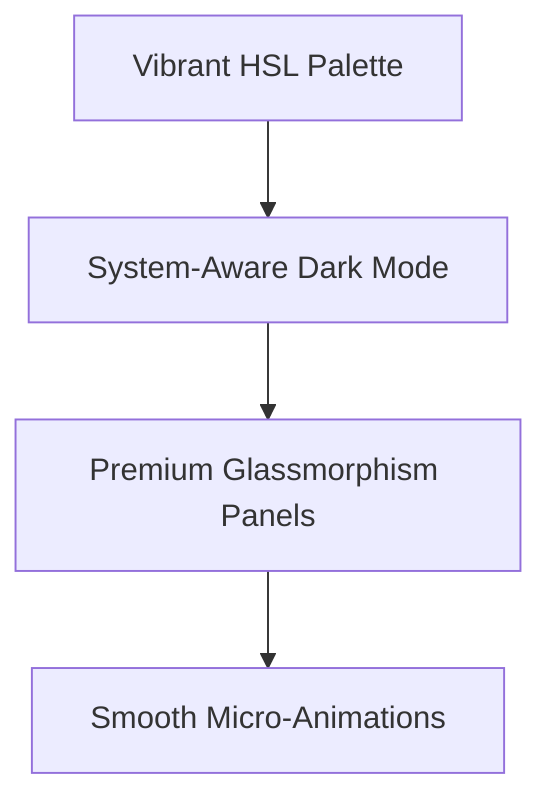
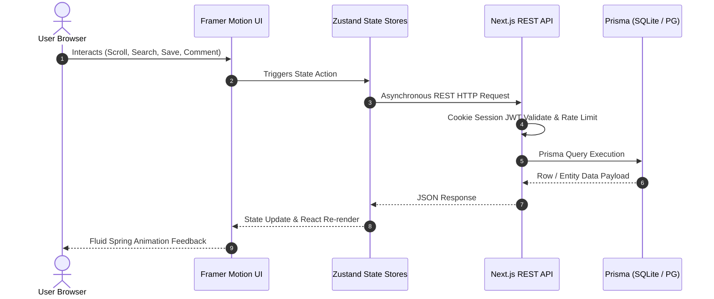
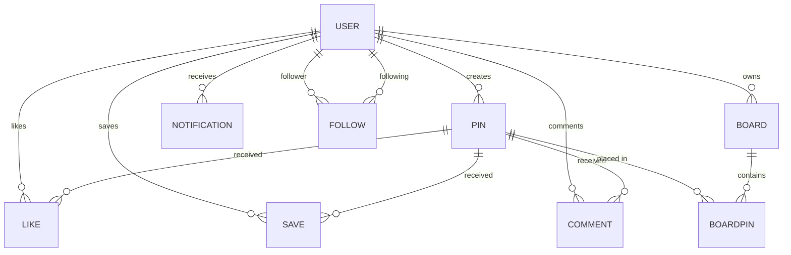

# 📌 Pinverse — Full-Stack Visual Discovery Platform

Pinverse is a high-performance, visually premium, and professionally engineered **Pinterest-inspired full-stack web application**. Designed with an absolute focus on modern UX/UI, fluid animation physics, secure token-based access sessions, and a highly scalable backend data architecture.

Built using **Next.js 16 (App Router)**, **React 19**, **TypeScript 5**, **Tailwind CSS 4**, **shadcn/ui**, **Prisma ORM**, and **Framer Motion**.

---

## 🎨 Premium UI/UX & Visual Aesthetics

Pinverse features a tailored design system built on curated, harmonious **HSL colors**, smooth **glassmorphism interfaces**, and elegant **micro-interactions**.



*   **🌓 Unified Dark/Light Mode:** System-aware, high-contrast, beautiful themes. Transitions occur smoothly across custom CSS components without white hydration flashes or layout shifts (CLS).
*   **✨ Framer Motion Physics:** Every view entry, image card hover, category selection, and modal popup uses customized spring physics and ease transitions for a premium, organic feel.
*   **🖼️ Intelligent Card States:** Image cards support layout-stable hover overlays, instant save dropdown menus, dynamic user attribution details, and fast like-activation buttons.

---

## ⚙️ Core Technical Architecture



---

## 🚀 Key Implemented Features

### 1️⃣ Frontend Capabilities
*   **📐 Pure CSS Masonry Grid (`MasonryGrid.tsx`):** Renders dynamic visual columns with clean browser-native CSS grids. Scales elements fluidly across mobile, tablet, and ultrawide viewports without CPU-intensive Javascript calculation loops.
*   **🔄 Viewport-Native Infinite Scroll:** Leverages the native browser `IntersectionObserver` API to silently fetch next-page pins as the user reaches the footer threshold. Displays clean skeleton layout loaders during fetches.
*   **🔒 Polished Authentication Screens:** `LoginView` and `RegisterView` feature customized, inline form validations, secure JWT error indicators, interactive show/hide password buttons, and styled single-sign-on (SSO) buttons.
*   **👤 Comprehensive Profiles:** Features user avatars, editable biography descriptions, absolute follower metrics, and separated interactive tabs:
    *   **Created Pins:** Displays only visual content uploaded by this user.
    *   **Saved Pins:** Displays all bookmarked visual assets pinned across the site.
    *   **Boards:** Custom folders curated by the user for categorized organizations.
*   **🔍 Interactive Header Category Filters & Search:** The top navbar hosts a dynamic search field and standard visual category quick-filters linked end-to-end to update the main feed instantly.

### 2️⃣ Backend REST API Capabilities
All routes are built utilizing high-efficiency Node.js NextRequest/NextResponse architecture under `src/app/api/**`:

*   **🔑 Secure Session JWT Auth (`/api/auth`):** Cookie-based validation using high-security signed tokens (`jose`). Ensures credentials are kept inside HTTP-only, secure, SameSite cookies to protect against XSS and CSRF attacks.
*   **🖼️ Upload Processing & Image Security (`/api/upload`):** Supports drag-and-drop or file selector uploads. Features magic-byte signature validation (checks underlying binary files to ensure uploaded images are not disguised script attacks).
*   **📂 Board Management Endpoints (`/api/boards`):** Full CRUD setup to create, read, update, or delete personalized boards. Users can mark boards as **Public** or **Private** to control visibility.
*   **💬 Social Engagement Engine (`/api/comments`, `/api/pins/[id]/like`):** Features instant toggling of likes and nested comments lists, generating automatic database references to map social activity.
*   **🔔 Real-Time Notification Center (`/api/notifications`):** Delivers instantaneous notifications to users when other creators follow them, save their pins, like their visual items, or post comments.

---

## 📂 Deep Codebase Directory Structure

```
pinverse/
├── prisma/
│   ├── schema.prisma          # Database schemas defining 8 structured models
│   └── seed.ts                # Mockup data seeder mapping high-res visual assets
├── src/
│   ├── app/
│   │   ├── layout.tsx         # Global context wrapper (Theme, Fonts, Toast Alerts, SEO)
│   │   ├── page.tsx           # Main Single Page App View Controller
│   │   ├── globals.css        # Core Tailwind CSS configuration and themes
│   │   ├── pin/               # Dynamic shareable route linking individual pin IDs
│   │   └── api/               # Next.js Node API Route Handlers (Auth, Pins, Uploads, Profiles)
│   ├── components/
│   │   ├── pinverse/          # Custom Visual Discovery Views (Auth, Profile, Masonry, Boards)
│   │   │   ├── Header.tsx     # Unified Navigation Header, Search, Filters
│   │   │   ├── PinCard.tsx    # Responsive grid card with hover interactions
│   │   │   ├── PinDetail.tsx  # Deep post detail view, board selector, social comments
│   │   │   └── AuthViews.tsx  # Secure Login and Register forms
│   │   └── ui/                # Reusable basic UI components (dialogs, cards, inputs, dropdowns)
│   ├── stores/                # Zustand Client-side state hooks (auth-store, pin-store, view-store)
│   └── lib/                   # Internal middleware (JWT, Password hashing, Rate limiter, Magic bytes)
├── public/
│   └── uploads/               # Local media directory for dev uploads
├── db/
│   └── custom.db              # Portable local SQLite database instance
├── .env.example               # Complete environment variables guide
├── next.config.ts             # Vercel and production storage setup configurations
├── tailwind.config.ts         # Tailwind CSS visual theme configuration
└── package.json               # Package dependencies configuration
```

---

## 📋 Comprehensive Database Schema (Prisma)

The application utilizes **8 tightly mapped relation models** configured to operate on SQLite locally and switch instantly to PostgreSQL:



1.  **👤 User:** Stores secure credentials (email, hashed password), avatar URL, bio details, and created/saved visual associations.
2.  **📌 Pin:** Represents visual items, containing titles, descriptions, categories, direct author IDs, and absolute image source links.
3.  **📂 Board:** Custom collections owned by users to categorize grouped pins under custom headers with privacy states.
4.  **🔗 BoardPin:** Mapped junction table managing many-to-many relationship mappings between various pins and boards.
5.  **❤️ Like:** Fast interaction tracker mapping relationships between specific users and pins.
6.  **💾 Save:** Keeps bookmarks cleanly mapped to users' personal feeds.
7.  **💬 Comment:** Standard nested text feed linking creator descriptions to pins with timestamp labels.
8.  **🔔 Notification:** Activity alert system notifying users when social events occur.

---

## 🛠️ Setup & Development Guide

### 1️⃣ Dependencies & Environmental Settings
Set up dependencies using [Bun](https://bun.sh) (highly recommended for performance) or Node.js 18+:
```bash
# Clone the repository and install packages
bun install

# Create environment config file
cp .env.example .env
```

### 2️⃣ Initialize Database & Mappings
Deploy the database migrations and seed mockup profiles/visual pins in one step:
```bash
# Auto-generate DB structures and create database custom file
bun run db:push

# Populate database models with high-quality mockup data
bun run db:seed
```

This populates the system with high-resolution image pins and provides dynamic accounts for immediate evaluations:
*   **📧 Main Tester Email:** `demo@pinverse.com`
*   **🔑 Password:** `demo123`
*   **📧 Additional Creator Accounts:** `creator1@pinverse.com` up to `creator5@pinverse.com` (password: `password123`)

### 3️⃣ Run Local Development Server
```bash
bun run dev
```
Open **[http://localhost:3000](http://localhost:3000)** inside your browser to explore the fully functional Pinverse application!

---

## 🔒 Security & Performance Features

*   **🔒 Magic-Byte Security Validator:** Protects uploads by inspecting the actual binary file headers (magic numbers like `FF D8 FF` for JPEG) rather than trusting simple file extensions. Prevents malicious scripts from being uploaded.
*   **⏱️ Rate-Limit Security Middleware:** Features active rate-limiting inside `/api/auth` routes to defend the server endpoints against brute-force login attacks.
*   **⚡ Hydration Protection:** Implements standard Next.js hydration-safe patterns for client-only widgets (such as theme selectors), ensuring zero visual layout shift (CLS) or SSR mismatches.
*   **📦 Optimized Production Builds:** Automatically pre-compiles and generates all database interfaces cleanly during build steps (`prisma generate && next build`) for instant production deployments.
